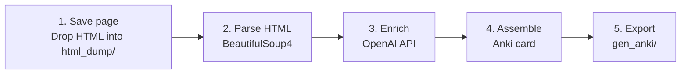

# CAST

[](https://github.com/MorrisGlr/clinical-anki-generator/actions/workflows/tests.yml)
[](https://codecov.io/gh/MorrisGlr/clinical-anki-generator)

[](LICENSE)

**Transform saved UWorld questions into AI-enhanced Anki flashcards in under 5 minutes. Built for MS3/MS4 clerkship and shelf exam prep.**

> **Note on the repo name:** This repository is named `clinical-anki-generator` to help medical students find it via GitHub search. The tool itself is called **CAST** (Clinical Anki Study Tool) — that is the name you will use whether you run it from the command line (`cast`) or via the local web UI (`cast serve`).

---

## Demo

<!-- Demo GIF recording in progress. Will show: saved UWorld HTML page going in, enriched Anki card coming out. -->

*Demo coming soon. See [What You Get](#what-you-get) below for a description of the output.*

---

## Quick Start (Recommended)

**New to the command line?** Follow the step-by-step guide in [SETUP.md](SETUP.md). It covers downloading CAST, getting an OpenAI API key, and running the setup script — no prior terminal experience needed.

After setup, verify everything works with:

```bash
cast check
```

Then drop your saved HTML files into `html_dump/` and run:

```bash
cast --platform uworld --tags
```

Import the generated file from `gen_anki/` into Anki using File > Import.

<details>
<summary>Developer Setup (manual install)</summary>

```bash
# 1. Clone and install
git clone https://github.com/MorrisGlr/clinical-anki-generator.git && cd clinical-anki-generator
pip install -e .

# 2. Add your OpenAI API key
echo "OPENAI_API_KEY=sk-your-key-here" > .env

# 3. Drop saved HTML files into html_dump/ and run
cast --platform uworld --tags
```

</details>

---

## What You Get

Each processed UWorld question becomes an Anki card with:

- **Vignette analysis** -- a step-by-step breakdown of how to work through the clinical stem.
- **Distractor logic** -- why each wrong answer is wrong and what clinical scenario would make it correct.
- **Pathophysiology review** -- the underlying mechanism connecting the question to its answer.
- **First/second/third-line treatment hierarchy** -- when applicable.
- **Auto-generated tags** -- six tags per card, generated by the same AI model that writes the enrichment (e.g., `cardiology heart_failure diuretics renal shelf-exam uworld`). The same concept may be labeled differently on different cards. To enable: pass `--tags` on the command line, or check **Add tags** in the Options panel of the web UI.
- **Confidence score** -- logged per card so you can spot questions where the LLM is less certain.
- **Optional validation pass** -- a second, lighter AI call reviews the enrichment for direct factual contradictions (wrong drug mechanism, inverted physiology, incorrect first-line treatment) and adds an orange warning banner to flagged cards. Treat flagged cards as a prompt to double-check, not a clean bill of health for unflagged ones. To enable: pass `--validate` on the command line, or check **Validate cards for accuracy** in the Options panel of the web UI.

### Format options

| Flag | Output |
|---|---|
| `--format basic` (default) | Question stem on front, full enrichment on back. |
| `--format cloze` | AI-generated cloze deletion stem, enrichment on back. |
| `--format choices-front` | Question + answer choices on front. |

### Supported platforms

| Platform | Input format |
|---|---|
| UWorld | Locally saved HTML (`cmd+s` / `ctrl+s`) |
| AMBOSS | Locally saved HTML |
| APGO | Locally saved HTML |
| NBME | Downloaded `.txt` file |

---

## How It Works



1. Open a UWorld question in your browser and save the page (`cmd+s` on macOS, `ctrl+s` on Windows). Drop the saved HTML file into the `html_dump/` directory.
2. Run `cast --platform uworld`. CAST reads all HTML files in `html_dump/` and extracts the question stem, answer choices, correct answer, and official explanation using BeautifulSoup4.
3. Each question is sent to the OpenAI API, which returns clinical reasoning enrichment as structured JSON (vignette analysis, distractor logic, pathophysiology, tags, confidence).
4. CAST assembles the card: question on the front, original explanation plus enriched content on the back, rendered as Anki-compatible HTML.
5. A single tab-separated import file is written to `gen_anki/`. Import it into Anki via File > Import. Images from `*_files/` companion directories are copied to Anki's media folder automatically.

---

## Why This Exists

Medical students on third- and fourth-year clerkships need to review large volumes of clinical reasoning under time pressure. UWorld questions are the gold standard for shelf exam prep -- but building Anki decks from them manually means a nightly copy-paste marathon after a full clinical day.

CAST reduces deck assembly from 1-2 hours to under 5 minutes for 40 questions, and adds clinical reasoning depth that UWorld's explanations alone do not provide.

### Why not use a SaaS tool like MedAnkiGen?

| | CAST | Cloud-based SaaS tools |
|---|---|---|
| Cost | Free (pay only for OpenAI API tokens, typically $0.01-0.10/card) | Monthly subscription |
| Privacy | Fully local -- your UWorld content never leaves your machine | Uploaded and stored on third-party servers |
| Open source | Yes -- fork it, extend it, inspect it | No |
| Customizable | Yes -- modify prompts, add parsers, change output format | No |
| Clinical reasoning enrichment | Vignette analysis + distractor logic per question | Generic flashcard generation |

The privacy point is not incidental. Many medical students are cautious about uploading question-bank content to third-party services, both for IP reasons and because study material often contains notes and annotations tied to their learning. CAST processes everything locally with your own API key.

---

## Limitations and Disclaimers

- **Accuracy:** This tool is provided as-is. AI-generated clinical content may contain errors. Always verify against primary sources before relying on any card for exam preparation.
- **UWorld terms of service:** CAST processes HTML pages that you have personally saved from your own paid UWorld subscription. You must hold an active paid personal UWorld license to use this tool with UWorld content. No UWorld content is stored in this repository or redistributed by this tool. CAST is not affiliated with, endorsed by, or officially connected to UWorld in any way. This usage is intended to fall within the fair use doctrine for individual education; consult a lawyer if you have legal questions.
- **Platform fragility:** UWorld, AMBOSS, and APGO use generated CSS class names that can change with any frontend deployment. If parsing breaks after a platform update, open an issue.
- **Image handling:** Image copying is confirmed for UWorld's `*_files/` companion directories. AMBOSS and APGO image handling is unverified.
- **Anki media path:** The default Anki media path is the macOS path (`~/Library/Application Support/Anki2/User 1/collection.media`). Override it with `--anki-media` on Windows or Linux.
- **Cost estimate:** Token costs depend on question length and model. Cached input tokens are billed at a discount by OpenAI; the run-total log notes this but does not compute the discounted rate. Models and pricing are regularly updated by OpenAI who are not affiliated to this project so these are only estimates. Please check your actual costs on the OpenAI API platform.

---

## Contributing

Contributions are welcome. Please read [CONTRIBUTING.md](CONTRIBUTING.md) before opening a pull request.

To report a bug or request a feature, use the [issue templates](https://github.com/MorrisGlr/clinical-anki-generator/issues/new/choose).

---

## Citation

If you use CAST in your research or share it with others, a citation is appreciated:

```
Aguilar, M. A. (2024). CAST: HTML-to-Anki Enhanced Human Explanation & Reasoning Tool.
GitHub. https://github.com/MorrisGlr/clinical-anki-generator
```

---

## Contact

Morris A. Aguilar, M.D., Ph.D.<br>
<a href="https://www.linkedin.com/in/morris-a-aguilar/">LinkedIn</a>
